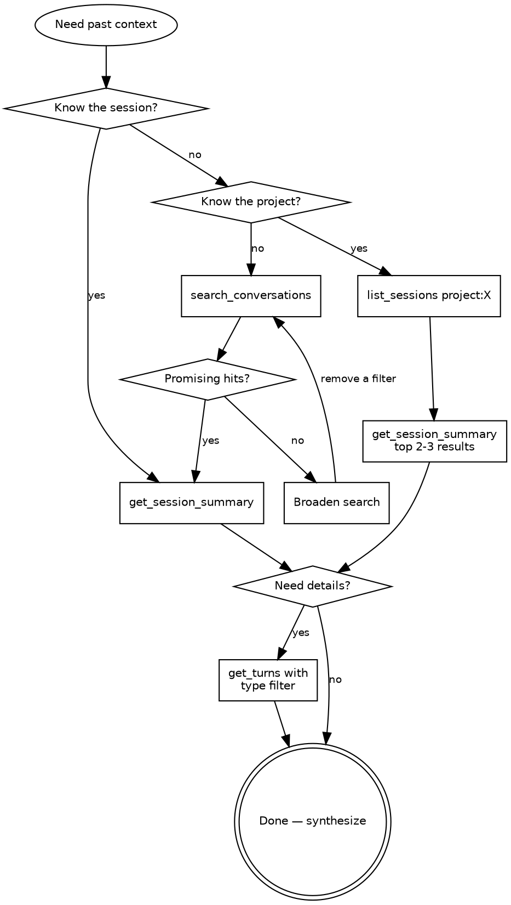

# ccvault Skill

## Overview

ccvault indexes Claude Code conversation history into a searchable SQLite/FTS5 archive with full-text search, structured filters, and session-level analytics. This skill teaches effective patterns for mining that history — finding past solutions, understanding project context, and learning from previous sessions. Use it proactively during implementation, not just when explicitly asked.

## When This Fires

- You need to understand what was previously done in a project
- An error or problem might have been solved in a prior session
- The user asks "what did I do", "how did we solve", "where did I leave off"
- You're about to implement something and want to check for prior art
- You need cross-project patterns or approaches
- Starting work in a project you haven't touched recently

**Proactive usage:** Don't wait to be asked. When you're about to implement something non-trivial, check if it was done before. When you hit an error, search for it. When you start a session in an unfamiliar project, orient first. The best use of ccvault is invisible to the user — you just know things because you checked.

## Commands

- **Orient** — Session-start context gathering. Pulls recent project history and synthesizes where things stand: what was worked on, what's in progress, and what decisions were made. See `./orient-prompt.md`
- **Recall** — On-demand historical lookup. Finds past solutions, decisions, and patterns by mining conversation history using targeted search strategies. See `./recall-prompt.md`

## The Search Playbook

How to navigate ccvault's tools efficiently. Follow this decision flow:

The key insight: always move from broad to specific. Summaries are cheap; full turns are expensive. Start with the lightest tool that could answer your question, then drill down only when you need more.

**Cost ladder** (cheapest to most expensive):
1. `search_conversations` — 200-char snippets, negligible context cost
2. `list_sessions` — session metadata only, no content
3. `get_session_summary` — metadata + first/last messages (500 chars each), top tools
4. `get_turns` with type filter — paginated content (1000 chars/turn), scoped to one role
5. `get_turns` without filter — all turn types, highest volume
6. `get_session` — full markdown dump, only for small sessions (<100 turns)

Stay as high on this ladder as possible. Most questions are answerable at levels 1-3.

## Five Search Patterns

| Pattern | When | Steps |
|---------|------|-------|
| Summary before deep dive | Any session lookup | `get_session_summary` first, then `get_turns` only if more detail needed |
| Narrow first, broaden later | Searching for specifics | Start with all relevant filters (`project:X tool:Y "phrase"`), remove one at a time if no results |
| Project scan | Orienting in a project | `list_sessions project:X` then `get_session_summary` for top 2-3 by date |
| Solution mining | Problem you've seen before | `search_conversations "error text"` then verify with `get_session_summary` |
| Cross-project learning | Looking for patterns | Search without `project:` filter, group results by project path |

### Pattern selection guidance

When in doubt, start with **Solution mining** if you have an error message or specific phrase, **Project scan** if you know the project but not the topic, and **Cross-project learning** when exploring how something was done anywhere. The **Narrow first, broaden later** pattern is a meta-strategy that applies on top of any other pattern — always start with the most specific query you can construct.

## Efficiency Rules

1. `get_session_summary` is always your first stop for any session — never go to `get_turns` or `get_session` without it
2. `search_conversations` returns 200-char snippets — enough to judge relevance without burning context
3. Use `get_turns` with `type: "user"` to see just what the human asked, or `type: "assistant"` for just responses
4. Always check `has_more` / `next_offset` in paginated results — don't stop at page 1
5. Never use `get_session` for sessions with 100+ turns — it returns a warning instead of content
6. Combine operators to narrow before free-text: `project:X tool:Bash "deploy"` beats just `"deploy"`
7. Use `list_projects` to discover correct project names before searching — partial match is forgiving but exact names yield better results
8. When mining solutions, search for the error message text in quotes — FTS5 exact phrase matching is the fastest path to relevant sessions

## Anti-Patterns

**Do not do these things.** Each wastes context, returns noise, or silently fails.

- Fetching full sessions (`get_session`) when summaries suffice — wastes context window
- Broad free-text searches without operators — returns too much noise
- Ignoring pagination — the best results might be on page 2+
- Using `get_session` for large sessions (100+ turns) — server returns a warning, not content
- Searching for MCP tool names like `mcp__ccvault__search_conversations` — the database stores tool names as they appear in Claude Code logs (e.g., `Bash`, `Read`, `Edit`, not the prefixed MCP names)
- Not using `type` filter on `get_turns` — reading all turn types when you only need user or assistant messages
- Repeating searches with the same query — if it didn't work, change the query terms or operators, don't retry the same thing
- Using `has:error` or `has:subagent` without a text query — these are session-level flags, so results show all turns from matching sessions, not just the error turns themselves

## Quick Reference

For full tool parameters, query syntax, and recipes, see `./reference.md`
